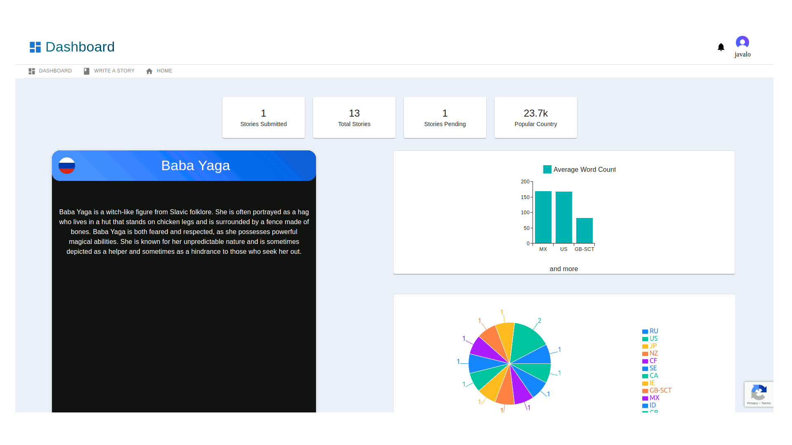

### Folklore Web Service  

* Description: FolkloreAPI is a web service for the everyday writer, inspired artist etc. It stemmed from my desire to start writing where, in doing some research, I found inspiration from various forums and articles on the different categories of folklore and their origins. The hope is for users to submit their own versions of folklore stories to the web service and for it be freely accessible to others looking for the same type of resource.   
* Tools: REACT, Express, Axios, JavaScript, HTML, CSS,  